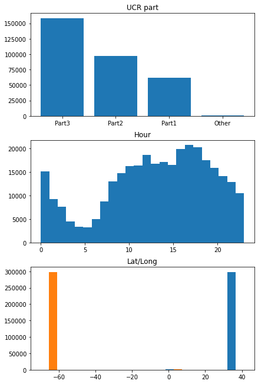
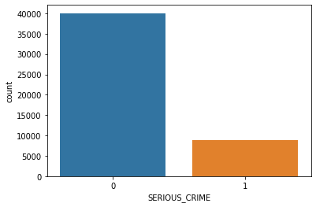
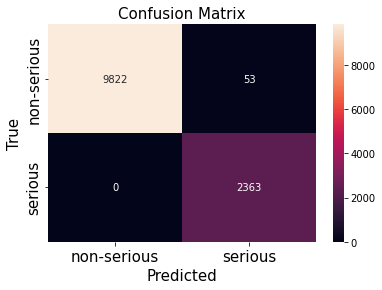

# Crime Hour

## Introduction

Purpose of this machine learning project is to create model to predict, if serious crime happens within certain area of
Boston, and at what time. Purpose is also to create a method which could be used at other locations with proper data.

Objective is to aid police in optimizing and coordinating their resources for patrolling. I will first formulate the problem and describe the dataset.Then I will discuss methods,features, and the machine learning model. Lastly I will summarize the result.

### Module and data imports:

```python
# module imports

import matplotlib.pyplot as plt
import numpy as np
import pandas as pd
import pydotplus
import seaborn as sns
from imblearn.over_sampling import SMOTE
from sklearn.cluster import KMeans
from sklearn.ensemble import RandomForestRegressor
from sklearn.linear_model import LogisticRegression
from sklearn.metrics import (  # evaluation metrics
    accuracy_score,
    classification_report,
    confusion_matrix,
)
from sklearn.model_selection import train_test_split
from sklearn.tree import (
    DecisionTreeClassifier,
    export_graphviz,
    export_text,
    plot_tree,
)
```

```python
# data imports

offence_codes = pd.read_csv("offense_codes.csv", encoding="mbcs")
df = pd.read_csv("crime.csv", encoding="mbcs")
```

## Problem Formulation

I try to recognize pattern in data that would allow us to make a hypothesis about occurrence of serious crime in Boston by time of day.
Goal is to predict rare, serious crime happening on specific time at some specific region of Boston. I need to predict the rare event (serious crime) happening on a specific time and region.

From feature vector X, I need to be able to predict label y’, so that y’ = 1 if serious crime event happens at chosen time (t) and area (a), otherwise 0.

$
y = \left\{
    \begin{array}\\
        1 & \mbox{if } \ (\ t,\ a, serious\ crime\ )\\
        0 & \mbox{else.}
    \end{array}
\right\}
$

### Dataset

Dataset is originally from Analyze Boston which is city of Boston’s open data hub. Crime
incident reports are provided by Boston Police Department (BPD) to document the initial
details surrounding an incident to which BPD officers respond.

This is a dataset containing records from the new crime incident report system, which
includes a reduced set of fields focused on capturing the type of incident as well as when and where it occurred. Origin dataset has 319073 data points (17 columns), with some
missing values. Latitude and longitude variables contain some outliers.

Dataset doesn’t contain labels as such. I will create label that represents the event that
serious crime happened on that hour. I will discuss label creation more in methods section.
Having a label makes this a supervised learning task. Task is to predict a class of the record
and class has two possible values (0, 1).

```python
df.describe()
```

<div>
<style scoped>
    .dataframe tbody tr th:only-of-type {
        vertical-align: middle;
    }

    .dataframe tbody tr th {
        vertical-align: top;
    }

    .dataframe thead th {
        text-align: right;
    }

</style>
<table border="1" class="dataframe">
  <thead>
    <tr style="text-align: right;">
      <th></th>
      <th>OFFENSE_CODE</th>
      <th>YEAR</th>
      <th>MONTH</th>
      <th>HOUR</th>
      <th>Lat</th>
      <th>Long</th>
    </tr>
  </thead>
  <tbody>
    <tr>
      <th>count</th>
      <td>319073.000000</td>
      <td>319073.000000</td>
      <td>319073.000000</td>
      <td>319073.000000</td>
      <td>299074.000000</td>
      <td>299074.000000</td>
    </tr>
    <tr>
      <th>mean</th>
      <td>2317.546956</td>
      <td>2016.560586</td>
      <td>6.609719</td>
      <td>13.118205</td>
      <td>42.214381</td>
      <td>-70.908272</td>
    </tr>
    <tr>
      <th>std</th>
      <td>1185.285543</td>
      <td>0.996344</td>
      <td>3.273691</td>
      <td>6.294205</td>
      <td>2.159766</td>
      <td>3.493618</td>
    </tr>
    <tr>
      <th>min</th>
      <td>111.000000</td>
      <td>2015.000000</td>
      <td>1.000000</td>
      <td>0.000000</td>
      <td>-1.000000</td>
      <td>-71.178674</td>
    </tr>
    <tr>
      <th>25%</th>
      <td>1001.000000</td>
      <td>2016.000000</td>
      <td>4.000000</td>
      <td>9.000000</td>
      <td>42.297442</td>
      <td>-71.097135</td>
    </tr>
    <tr>
      <th>50%</th>
      <td>2907.000000</td>
      <td>2017.000000</td>
      <td>7.000000</td>
      <td>14.000000</td>
      <td>42.325538</td>
      <td>-71.077524</td>
    </tr>
    <tr>
      <th>75%</th>
      <td>3201.000000</td>
      <td>2017.000000</td>
      <td>9.000000</td>
      <td>18.000000</td>
      <td>42.348624</td>
      <td>-71.062467</td>
    </tr>
    <tr>
      <th>max</th>
      <td>3831.000000</td>
      <td>2018.000000</td>
      <td>12.000000</td>
      <td>23.000000</td>
      <td>42.395042</td>
      <td>-1.000000</td>
    </tr>
  </tbody>
</table>
</div>

```python
df.info();
```

    <class 'pandas.core.frame.DataFrame'>
    RangeIndex: 319073 entries, 0 to 319072
    Data columns (total 17 columns):
     #   Column               Non-Null Count   Dtype
    ---  ------               --------------   -----
     0   INCIDENT_NUMBER      319073 non-null  object
     1   OFFENSE_CODE         319073 non-null  int64
     2   OFFENSE_CODE_GROUP   319073 non-null  object
     3   OFFENSE_DESCRIPTION  319073 non-null  object
     4   DISTRICT             317308 non-null  object
     5   REPORTING_AREA       319073 non-null  object
     6   SHOOTING             1019 non-null    object
     7   OCCURRED_ON_DATE     319073 non-null  object
     8   YEAR                 319073 non-null  int64
     9   MONTH                319073 non-null  int64
     10  DAY_OF_WEEK          319073 non-null  object
     11  HOUR                 319073 non-null  int64
     12  UCR_PART             318983 non-null  object
     13  STREET               308202 non-null  object
     14  Lat                  299074 non-null  float64
     15  Long                 299074 non-null  float64
     16  Location             319073 non-null  object
    dtypes: float64(2), int64(4), object(11)
    memory usage: 41.4+ MB

### Features

```python
df.columns;
```

Above print out lists features of the dataset.

Based on reasoning important features of the dataset are latitude/longitude, occurred-on-date, hour and ucr_part. More about this reasoning later in method section.

Other features of this dataset are incident number, offense description, district, shooting, Offense code group, Reporting area, street, location, and break-down columns of occurred on date. So most of the other variables are subsets of the main variables.

Description of main features:

- Latitude/longitude are coordinates where the event took place
- Occurred-on-date and hour are date and time
- Ucr part means universal crime reporting part

FBI uses ucr parts to classify crimes by their seriousness. Ucr part 1 consists of most serious crimes, part 2 and part3 are less serious crimes.

```python
%matplotlib inline

fig, ax = plt.subplots(nrows=3, ncols=1, figsize=(6, 9))
fig.tight_layout(h_pad=2)

# amount different crimes and times reported
cat = ['Part3','Part2','Part1','Other']
ax[0].bar(cat, df['UCR_PART'].value_counts())
ax[0].set_title('UCR part')
ax[1].hist(df['HOUR'], bins=24)
ax[1].set_title('Hour')
ax[2].hist(df[['Lat','Long']])
ax[2].set_title('Lat/Long')
```

    Text(0.5, 1.0, 'Lat/Long')



## Method

### Missing values

Empty values will be dropped from dataset because seems there is enough data. It would be possible to determine missing coordinate values e.g. from street, but it would take a lot of effort. Most of the missing coordinate values are for P2 and P3 class of crimes (less serious crimes). Only 90 UCR crime values are missing.

After the missing values are removed we are left with 298095 samples.

```python
# missing coordinates and UCR type

missing_coord = df[(df['Lat'].isnull())]

print('lost info when missing coordinates')
print('missing P3:', len(missing_coord[missing_coord['UCR_PART'] == 'Part Three']))
print('missing P2:', len(missing_coord[missing_coord['UCR_PART'] == 'Part Two']))
print('missing P1:', len(missing_coord[missing_coord['UCR_PART'] == 'Part One']))
```

    lost info when missing coordinates
    missing P3: 11068
    missing P2: 6252
    missing P1: 2599

```python
missing_ucr = df[(df['UCR_PART'].isnull())]
print('missing UCR part: ', len(missing_ucr))
```

    missing UCR part:  90

```python
## dropping missing values
df.dropna(axis=0, subset=["UCR_PART",'Lat', 'Long'], inplace=True)
```

```python
len(df)
```

    298984

### Clustering

Longitude and latitude are used to divide Boston into grid of 100 areas by clustering. If clustering is not feasible, city is divided into grid by district. Nearest neighbor method is  
used to find the clusters. Algorithm used is k-means. It divides set of N samples X into K  
clusters C. Cluster is described by its means.

As loss function K-means uses:

$\sum*{i=0}^{n}\min*{\mu_j \in C}(||\ x_i - \mu_j\ ||^2) $

Clustering is done around 'centers'. These are lat and long coordinate of crime instance.  
There are few outliers in lat and long variables which need to be removed before clustering.

```python
# remove outlier and create centers
df = df[(df.Lat > 40) & (df.Long < -71)]
center = df[["Lat", "Long"]]
```

```python
# plot centers
fig, ax = plt.subplots()
ax.scatter(center["Long"], center["Lat"])
```

    <matplotlib.collections.PathCollection at 0x1982df9bf10>


K-means algorithm creates 100 clusters from centers by predicting the cluster center belongs to.  
These cluster are numberred as integers.

```python
kmeans = KMeans(n_clusters=100, random_state=1).fit(center[["Long", "Lat"]])
preds = kmeans.predict(center[["Long", "Lat"]])
```

### Data transformation

Hour feature is used to determine time of day. Original data contained breakdown of
Occurred-on-date variable. From these I will use day-of-week as feature,and process it into integer presenting weekday. I assume intuitively, that weekday might be a factor in crime doing.

I also add clusters as area_no into data variable I will be using for predictions, and take one year sample of the original data. After all this I have 61186 samples.

```python
df["OCCURRED_ON_DATE"] = df["OCCURRED_ON_DATE"].str[:10]
df.rename(columns={"OCCURRED_ON_DATE": "DATE"}, inplace=True)

data = df.loc[:, ["DATE", "HOUR", "UCR_PART"]]
data["DATE"] = pd.to_datetime(data["DATE"])
data["DAY"] = data["DATE"].dt.dayofweek
data["AREA_NO"] = preds
```

```python
data = data[data["DATE"] > pd.to_datetime("12-31-2017")]
data["UCR_PART"] = data.loc[:, "UCR_PART"].str[4:]
data["UCR_PART"] = data["UCR_PART"].str.strip()
data.head(2)
```

<div>
<style scoped>
    .dataframe tbody tr th:only-of-type {
        vertical-align: middle;
    }

    .dataframe tbody tr th {
        vertical-align: top;
    }

    .dataframe thead th {
        text-align: right;
    }

</style>
<table border="1" class="dataframe">
  <thead>
    <tr style="text-align: right;">
      <th></th>
      <th>DATE</th>
      <th>HOUR</th>
      <th>UCR_PART</th>
      <th>DAY</th>
      <th>AREA_NO</th>
    </tr>
  </thead>
  <tbody>
    <tr>
      <th>0</th>
      <td>2018-09-02</td>
      <td>13</td>
      <td>One</td>
      <td>6</td>
      <td>54</td>
    </tr>
    <tr>
      <th>1</th>
      <td>2018-08-21</td>
      <td>0</td>
      <td>Two</td>
      <td>1</td>
      <td>51</td>
    </tr>
  </tbody>
</table>
</div>

UCR_PART feature is needed to determine seriousness of the crime event. This feature is used
to create a label for the records. By using UCR_PART we can avoid using offense code group to
determine the label, since these are numerous, but lose flexibility to determine the 'serious crime'.

I will label the data 1 or 0 depending on whether serious crime happened or not. Label column will be added to data matrix.

UCR_PART is split into columns with values 1 or 0 representing the event of that type of
crime happening. This creates three features (ucr_1, ucr_2, ucr_3) into our data. Logic for
using crime types as variables is to tie areas into crime certain types; To see if there is areas where only lesser crimes are committed, and if it affects the probability of serious events happening. In other words, to take into calculation lesser crimes as indicator of more serious crimes.

```python
dummies = pd.get_dummies(data["UCR_PART"], prefix="Ucr")
data = pd.concat([data, dummies], axis=1).drop("UCR_PART", axis=1)
```

```python
data.head(2)
```

<div>
<style scoped>
    .dataframe tbody tr th:only-of-type {
        vertical-align: middle;
    }

    .dataframe tbody tr th {
        vertical-align: top;
    }

    .dataframe thead th {
        text-align: right;
    }

</style>
<table border="1" class="dataframe">
  <thead>
    <tr style="text-align: right;">
      <th></th>
      <th>DATE</th>
      <th>HOUR</th>
      <th>DAY</th>
      <th>AREA_NO</th>
      <th>Ucr_One</th>
      <th>Ucr_Three</th>
      <th>Ucr_Two</th>
      <th>Ucr_r</th>
    </tr>
  </thead>
  <tbody>
    <tr>
      <th>0</th>
      <td>2018-09-02</td>
      <td>13</td>
      <td>6</td>
      <td>54</td>
      <td>1</td>
      <td>0</td>
      <td>0</td>
      <td>0</td>
    </tr>
    <tr>
      <th>1</th>
      <td>2018-08-21</td>
      <td>0</td>
      <td>1</td>
      <td>51</td>
      <td>0</td>
      <td>0</td>
      <td>1</td>
      <td>0</td>
    </tr>
  </tbody>
</table>
</div>

```python
data["SERIOUS_CRIME"] = np.where(data["Ucr_One"] == 1, 1, 0)
data = data.iloc[:, [0, 1, 2, 3, 5, 6, 8]]
data.head(2)
```

<div>
<style scoped>
    .dataframe tbody tr th:only-of-type {
        vertical-align: middle;
    }

    .dataframe tbody tr th {
        vertical-align: top;
    }

    .dataframe thead th {
        text-align: right;
    }

</style>
<table border="1" class="dataframe">
  <thead>
    <tr style="text-align: right;">
      <th></th>
      <th>DATE</th>
      <th>HOUR</th>
      <th>DAY</th>
      <th>AREA_NO</th>
      <th>Ucr_Three</th>
      <th>Ucr_Two</th>
      <th>SERIOUS_CRIME</th>
    </tr>
  </thead>
  <tbody>
    <tr>
      <th>0</th>
      <td>2018-09-02</td>
      <td>13</td>
      <td>6</td>
      <td>54</td>
      <td>0</td>
      <td>0</td>
      <td>1</td>
    </tr>
    <tr>
      <th>1</th>
      <td>2018-08-21</td>
      <td>0</td>
      <td>1</td>
      <td>51</td>
      <td>0</td>
      <td>1</td>
      <td>0</td>
    </tr>
  </tbody>
</table>
</div>

Data is divided by date into 80% train data and 20% test data of the data set. Choice is due convention and approach is trial and error. Samples for training set and test set are chosen randomly to ensure i.i.d and so approximates the _expected loss_ of the hypothesis. In addition, validation set is extracted from the training set later.

```python
X = data.loc[:, data.columns != "SERIOUS_CRIME"]
y = data.loc[:, data.columns == "SERIOUS_CRIME"]

# train-test split

X_train, X_test, y_train, y_test = train_test_split(
    X, y, test_size=0.2, random_state=42
)
```

```python
y_test["SERIOUS_CRIME"].value_counts()
```

    0    9875
    1    2363
    Name: SERIOUS_CRIME, dtype: int64

```python
# imbalance rate

print(y_train["SERIOUS_CRIME"].value_counts(normalize=True))

# imbalance of Y
sns.countplot(x="SERIOUS_CRIME", data=y_train)
plt.show()
```

    0    0.81748
    1    0.18252
    Name: SERIOUS_CRIME, dtype: float64



Because we are predicting rare event, our data is highly imbalanced. Usual validation approaches require the validation set to be a good representative for the overall statistical properties of the data. In our case y = 1 labels are rare and but still representative of the underlying data. To be sure, we attack this imbalance with SMOTE (Synthetic Minority Over-Sampling Technique).

We generate synthetic data points for minority class to learn and validate the hypothesis. This method is called oversampling and it generates data in such a way that it resembles the underlying distribution of the real data. SMOTE works by getting K-nearest-neighbors and synthesizes a new instance of the minority label at a random location in the line between the current observation and its nearest neighbor.

```python
# converting to unix time and integer to maintain variance
X_train['DATE'] = (X_train['DATE'] - pd.Timestamp("1970-01-01")) // pd.Timedelta('1s')
X_train = X_train.astype(int)
```

```python
X_train.drop('DATE', axis=1, inplace=True)
X_test.drop('DATE', axis=1, inplace = True)
# over sampling to balance the dataset

smote = SMOTE(random_state=42)
X_train_smote, y_train_smote = smote.fit_resample(X_train, y_train)

print(f"no: samples: {len(X_train_smote)}")
print(y_train_smote["SERIOUS_CRIME"].value_counts())
```

    no: samples: 80028
    0    40014
    1    40014
    Name: SERIOUS_CRIME, dtype: int64

```python
# to numpy array

y_train_smote = y_train_smote["SERIOUS_CRIME"].to_numpy()
y_train_smote.shape
```

    (80028,)

### Model

Because we are predicting 1 or 0, this is a binary classification problem. I chose logistic regression as model because it’s simplicity in predicting classes using linear regression
hypothesis space, more specifically polynomial regression. First, we apply feature map, then use linear regression. Logistic regression allows to predict labels according two categories.

Logistic loss is used as loss function because it is convex and differentiable function so minimizing it is easier.  
_Logistic loss_:

$$
L\ = \ ((x,\ y),\ h) \ := \log(1 + \exp(-yh( x )))
$$

Loss function _should deliver_ large values for a hypothesis that is very confident in a wrong classification and deliver small values for a hypothesis that is very confident in a correct classification. Logistic loss does this; it decreases monotonically with increasing confidence for correct classification and increases monotonically with confidence in wrong classification.

I will train three models, main model logistic regression, plus decision tree and random forest for comparing. After that I will discuss results.

**Logistic regression**

```python
# splitting train and validation data from SMOTE dataset
X_train, X_val, y_train, y_val = train_test_split(
    X_train_smote, y_train_smote, test_size=0.2, random_state=42
)

# build balanced logistic regression model
logreg = LogisticRegression()
logreg.fit(X_train, y_train)
```

<style>#sk-container-id-1 {color: black;background-color: white;}#sk-container-id-1 pre{padding: 0;}#sk-container-id-1 div.sk-toggleable {background-color: white;}#sk-container-id-1 label.sk-toggleable__label {cursor: pointer;display: block;width: 100%;margin-bottom: 0;padding: 0.3em;box-sizing: border-box;text-align: center;}#sk-container-id-1 label.sk-toggleable__label-arrow:before {content: "▸";float: left;margin-right: 0.25em;color: #696969;}#sk-container-id-1 label.sk-toggleable__label-arrow:hover:before {color: black;}#sk-container-id-1 div.sk-estimator:hover label.sk-toggleable__label-arrow:before {color: black;}#sk-container-id-1 div.sk-toggleable__content {max-height: 0;max-width: 0;overflow: hidden;text-align: left;background-color: #f0f8ff;}#sk-container-id-1 div.sk-toggleable__content pre {margin: 0.2em;color: black;border-radius: 0.25em;background-color: #f0f8ff;}#sk-container-id-1 input.sk-toggleable__control:checked~div.sk-toggleable__content {max-height: 200px;max-width: 100%;overflow: auto;}#sk-container-id-1 input.sk-toggleable__control:checked~label.sk-toggleable__label-arrow:before {content: "▾";}#sk-container-id-1 div.sk-estimator input.sk-toggleable__control:checked~label.sk-toggleable__label {background-color: #d4ebff;}#sk-container-id-1 div.sk-label input.sk-toggleable__control:checked~label.sk-toggleable__label {background-color: #d4ebff;}#sk-container-id-1 input.sk-hidden--visually {border: 0;clip: rect(1px 1px 1px 1px);clip: rect(1px, 1px, 1px, 1px);height: 1px;margin: -1px;overflow: hidden;padding: 0;position: absolute;width: 1px;}#sk-container-id-1 div.sk-estimator {font-family: monospace;background-color: #f0f8ff;border: 1px dotted black;border-radius: 0.25em;box-sizing: border-box;margin-bottom: 0.5em;}#sk-container-id-1 div.sk-estimator:hover {background-color: #d4ebff;}#sk-container-id-1 div.sk-parallel-item::after {content: "";width: 100%;border-bottom: 1px solid gray;flex-grow: 1;}#sk-container-id-1 div.sk-label:hover label.sk-toggleable__label {background-color: #d4ebff;}#sk-container-id-1 div.sk-serial::before {content: "";position: absolute;border-left: 1px solid gray;box-sizing: border-box;top: 0;bottom: 0;left: 50%;z-index: 0;}#sk-container-id-1 div.sk-serial {display: flex;flex-direction: column;align-items: center;background-color: white;padding-right: 0.2em;padding-left: 0.2em;position: relative;}#sk-container-id-1 div.sk-item {position: relative;z-index: 1;}#sk-container-id-1 div.sk-parallel {display: flex;align-items: stretch;justify-content: center;background-color: white;position: relative;}#sk-container-id-1 div.sk-item::before, #sk-container-id-1 div.sk-parallel-item::before {content: "";position: absolute;border-left: 1px solid gray;box-sizing: border-box;top: 0;bottom: 0;left: 50%;z-index: -1;}#sk-container-id-1 div.sk-parallel-item {display: flex;flex-direction: column;z-index: 1;position: relative;background-color: white;}#sk-container-id-1 div.sk-parallel-item:first-child::after {align-self: flex-end;width: 50%;}#sk-container-id-1 div.sk-parallel-item:last-child::after {align-self: flex-start;width: 50%;}#sk-container-id-1 div.sk-parallel-item:only-child::after {width: 0;}#sk-container-id-1 div.sk-dashed-wrapped {border: 1px dashed gray;margin: 0 0.4em 0.5em 0.4em;box-sizing: border-box;padding-bottom: 0.4em;background-color: white;}#sk-container-id-1 div.sk-label label {font-family: monospace;font-weight: bold;display: inline-block;line-height: 1.2em;}#sk-container-id-1 div.sk-label-container {text-align: center;}#sk-container-id-1 div.sk-container {/* jupyter's `normalize.less` sets `[hidden] { display: none; }` but bootstrap.min.css set `[hidden] { display: none !important; }` so we also need the `!important` here to be able to override the default hidden behavior on the sphinx rendered scikit-learn.org. See: https://github.com/scikit-learn/scikit-learn/issues/21755 */display: inline-block !important;position: relative;}#sk-container-id-1 div.sk-text-repr-fallback {display: none;}</style><div id="sk-container-id-1" class="sk-top-container"><div class="sk-text-repr-fallback"><pre>LogisticRegression()</pre><b>In a Jupyter environment, please rerun this cell to show the HTML representation or trust the notebook. <br />On GitHub, the HTML representation is unable to render, please try loading this page with nbviewer.org.</b></div><div class="sk-container" hidden><div class="sk-item"><div class="sk-estimator sk-toggleable"><input class="sk-toggleable__control sk-hidden--visually" id="sk-estimator-id-1" type="checkbox" checked><label for="sk-estimator-id-1" class="sk-toggleable__label sk-toggleable__label-arrow">LogisticRegression</label><div class="sk-toggleable__content"><pre>LogisticRegression()</pre></div></div></div></div></div>

```python
# training error
print(f"training error: {1-logreg.score(X_train, y_train)}")

# validation error
y_pred_val = logreg.predict(X_val)
print(f"validation error: {1-accuracy_score(y_val, y_pred_val)}")
```

    training error: 0.002296085720533525
    validation error: 0.0026240159940023045

**Decision tree**

```python
# train decision tree
dtree = DecisionTreeClassifier(random_state=42)
dtree.fit(X_train, y_train)
```

<style>#sk-container-id-2 {color: black;background-color: white;}#sk-container-id-2 pre{padding: 0;}#sk-container-id-2 div.sk-toggleable {background-color: white;}#sk-container-id-2 label.sk-toggleable__label {cursor: pointer;display: block;width: 100%;margin-bottom: 0;padding: 0.3em;box-sizing: border-box;text-align: center;}#sk-container-id-2 label.sk-toggleable__label-arrow:before {content: "▸";float: left;margin-right: 0.25em;color: #696969;}#sk-container-id-2 label.sk-toggleable__label-arrow:hover:before {color: black;}#sk-container-id-2 div.sk-estimator:hover label.sk-toggleable__label-arrow:before {color: black;}#sk-container-id-2 div.sk-toggleable__content {max-height: 0;max-width: 0;overflow: hidden;text-align: left;background-color: #f0f8ff;}#sk-container-id-2 div.sk-toggleable__content pre {margin: 0.2em;color: black;border-radius: 0.25em;background-color: #f0f8ff;}#sk-container-id-2 input.sk-toggleable__control:checked~div.sk-toggleable__content {max-height: 200px;max-width: 100%;overflow: auto;}#sk-container-id-2 input.sk-toggleable__control:checked~label.sk-toggleable__label-arrow:before {content: "▾";}#sk-container-id-2 div.sk-estimator input.sk-toggleable__control:checked~label.sk-toggleable__label {background-color: #d4ebff;}#sk-container-id-2 div.sk-label input.sk-toggleable__control:checked~label.sk-toggleable__label {background-color: #d4ebff;}#sk-container-id-2 input.sk-hidden--visually {border: 0;clip: rect(1px 1px 1px 1px);clip: rect(1px, 1px, 1px, 1px);height: 1px;margin: -1px;overflow: hidden;padding: 0;position: absolute;width: 1px;}#sk-container-id-2 div.sk-estimator {font-family: monospace;background-color: #f0f8ff;border: 1px dotted black;border-radius: 0.25em;box-sizing: border-box;margin-bottom: 0.5em;}#sk-container-id-2 div.sk-estimator:hover {background-color: #d4ebff;}#sk-container-id-2 div.sk-parallel-item::after {content: "";width: 100%;border-bottom: 1px solid gray;flex-grow: 1;}#sk-container-id-2 div.sk-label:hover label.sk-toggleable__label {background-color: #d4ebff;}#sk-container-id-2 div.sk-serial::before {content: "";position: absolute;border-left: 1px solid gray;box-sizing: border-box;top: 0;bottom: 0;left: 50%;z-index: 0;}#sk-container-id-2 div.sk-serial {display: flex;flex-direction: column;align-items: center;background-color: white;padding-right: 0.2em;padding-left: 0.2em;position: relative;}#sk-container-id-2 div.sk-item {position: relative;z-index: 1;}#sk-container-id-2 div.sk-parallel {display: flex;align-items: stretch;justify-content: center;background-color: white;position: relative;}#sk-container-id-2 div.sk-item::before, #sk-container-id-2 div.sk-parallel-item::before {content: "";position: absolute;border-left: 1px solid gray;box-sizing: border-box;top: 0;bottom: 0;left: 50%;z-index: -1;}#sk-container-id-2 div.sk-parallel-item {display: flex;flex-direction: column;z-index: 1;position: relative;background-color: white;}#sk-container-id-2 div.sk-parallel-item:first-child::after {align-self: flex-end;width: 50%;}#sk-container-id-2 div.sk-parallel-item:last-child::after {align-self: flex-start;width: 50%;}#sk-container-id-2 div.sk-parallel-item:only-child::after {width: 0;}#sk-container-id-2 div.sk-dashed-wrapped {border: 1px dashed gray;margin: 0 0.4em 0.5em 0.4em;box-sizing: border-box;padding-bottom: 0.4em;background-color: white;}#sk-container-id-2 div.sk-label label {font-family: monospace;font-weight: bold;display: inline-block;line-height: 1.2em;}#sk-container-id-2 div.sk-label-container {text-align: center;}#sk-container-id-2 div.sk-container {/* jupyter's `normalize.less` sets `[hidden] { display: none; }` but bootstrap.min.css set `[hidden] { display: none !important; }` so we also need the `!important` here to be able to override the default hidden behavior on the sphinx rendered scikit-learn.org. See: https://github.com/scikit-learn/scikit-learn/issues/21755 */display: inline-block !important;position: relative;}#sk-container-id-2 div.sk-text-repr-fallback {display: none;}</style><div id="sk-container-id-2" class="sk-top-container"><div class="sk-text-repr-fallback"><pre>DecisionTreeClassifier(random_state=42)</pre><b>In a Jupyter environment, please rerun this cell to show the HTML representation or trust the notebook. <br />On GitHub, the HTML representation is unable to render, please try loading this page with nbviewer.org.</b></div><div class="sk-container" hidden><div class="sk-item"><div class="sk-estimator sk-toggleable"><input class="sk-toggleable__control sk-hidden--visually" id="sk-estimator-id-2" type="checkbox" checked><label for="sk-estimator-id-2" class="sk-toggleable__label sk-toggleable__label-arrow">DecisionTreeClassifier</label><div class="sk-toggleable__content"><pre>DecisionTreeClassifier(random_state=42)</pre></div></div></div></div></div>

```python
# training error
print(f"training error: {1-dtree.score(X_train, y_train)}")

# validation error
y_pred_val = dtree.predict(X_val)
print(f"validation error: {1-accuracy_score(y_val, y_pred_val)}")
```

    training error: 0.0014213863984255948
    validation error: 0.0033737348494314867

**Random Forest**

```python
# Train the random forest model
rf = RandomForestRegressor()
rf.fit(X_train, y_train)
```

<style>#sk-container-id-3 {color: black;background-color: white;}#sk-container-id-3 pre{padding: 0;}#sk-container-id-3 div.sk-toggleable {background-color: white;}#sk-container-id-3 label.sk-toggleable__label {cursor: pointer;display: block;width: 100%;margin-bottom: 0;padding: 0.3em;box-sizing: border-box;text-align: center;}#sk-container-id-3 label.sk-toggleable__label-arrow:before {content: "▸";float: left;margin-right: 0.25em;color: #696969;}#sk-container-id-3 label.sk-toggleable__label-arrow:hover:before {color: black;}#sk-container-id-3 div.sk-estimator:hover label.sk-toggleable__label-arrow:before {color: black;}#sk-container-id-3 div.sk-toggleable__content {max-height: 0;max-width: 0;overflow: hidden;text-align: left;background-color: #f0f8ff;}#sk-container-id-3 div.sk-toggleable__content pre {margin: 0.2em;color: black;border-radius: 0.25em;background-color: #f0f8ff;}#sk-container-id-3 input.sk-toggleable__control:checked~div.sk-toggleable__content {max-height: 200px;max-width: 100%;overflow: auto;}#sk-container-id-3 input.sk-toggleable__control:checked~label.sk-toggleable__label-arrow:before {content: "▾";}#sk-container-id-3 div.sk-estimator input.sk-toggleable__control:checked~label.sk-toggleable__label {background-color: #d4ebff;}#sk-container-id-3 div.sk-label input.sk-toggleable__control:checked~label.sk-toggleable__label {background-color: #d4ebff;}#sk-container-id-3 input.sk-hidden--visually {border: 0;clip: rect(1px 1px 1px 1px);clip: rect(1px, 1px, 1px, 1px);height: 1px;margin: -1px;overflow: hidden;padding: 0;position: absolute;width: 1px;}#sk-container-id-3 div.sk-estimator {font-family: monospace;background-color: #f0f8ff;border: 1px dotted black;border-radius: 0.25em;box-sizing: border-box;margin-bottom: 0.5em;}#sk-container-id-3 div.sk-estimator:hover {background-color: #d4ebff;}#sk-container-id-3 div.sk-parallel-item::after {content: "";width: 100%;border-bottom: 1px solid gray;flex-grow: 1;}#sk-container-id-3 div.sk-label:hover label.sk-toggleable__label {background-color: #d4ebff;}#sk-container-id-3 div.sk-serial::before {content: "";position: absolute;border-left: 1px solid gray;box-sizing: border-box;top: 0;bottom: 0;left: 50%;z-index: 0;}#sk-container-id-3 div.sk-serial {display: flex;flex-direction: column;align-items: center;background-color: white;padding-right: 0.2em;padding-left: 0.2em;position: relative;}#sk-container-id-3 div.sk-item {position: relative;z-index: 1;}#sk-container-id-3 div.sk-parallel {display: flex;align-items: stretch;justify-content: center;background-color: white;position: relative;}#sk-container-id-3 div.sk-item::before, #sk-container-id-3 div.sk-parallel-item::before {content: "";position: absolute;border-left: 1px solid gray;box-sizing: border-box;top: 0;bottom: 0;left: 50%;z-index: -1;}#sk-container-id-3 div.sk-parallel-item {display: flex;flex-direction: column;z-index: 1;position: relative;background-color: white;}#sk-container-id-3 div.sk-parallel-item:first-child::after {align-self: flex-end;width: 50%;}#sk-container-id-3 div.sk-parallel-item:last-child::after {align-self: flex-start;width: 50%;}#sk-container-id-3 div.sk-parallel-item:only-child::after {width: 0;}#sk-container-id-3 div.sk-dashed-wrapped {border: 1px dashed gray;margin: 0 0.4em 0.5em 0.4em;box-sizing: border-box;padding-bottom: 0.4em;background-color: white;}#sk-container-id-3 div.sk-label label {font-family: monospace;font-weight: bold;display: inline-block;line-height: 1.2em;}#sk-container-id-3 div.sk-label-container {text-align: center;}#sk-container-id-3 div.sk-container {/* jupyter's `normalize.less` sets `[hidden] { display: none; }` but bootstrap.min.css set `[hidden] { display: none !important; }` so we also need the `!important` here to be able to override the default hidden behavior on the sphinx rendered scikit-learn.org. See: https://github.com/scikit-learn/scikit-learn/issues/21755 */display: inline-block !important;position: relative;}#sk-container-id-3 div.sk-text-repr-fallback {display: none;}</style><div id="sk-container-id-3" class="sk-top-container"><div class="sk-text-repr-fallback"><pre>RandomForestRegressor()</pre><b>In a Jupyter environment, please rerun this cell to show the HTML representation or trust the notebook. <br />On GitHub, the HTML representation is unable to render, please try loading this page with nbviewer.org.</b></div><div class="sk-container" hidden><div class="sk-item"><div class="sk-estimator sk-toggleable"><input class="sk-toggleable__control sk-hidden--visually" id="sk-estimator-id-3" type="checkbox" checked><label for="sk-estimator-id-3" class="sk-toggleable__label sk-toggleable__label-arrow">RandomForestRegressor</label><div class="sk-toggleable__content"><pre>RandomForestRegressor()</pre></div></div></div></div></div>

```python
print(f"training error: {1-rf.score(X_train, y_train)}")
print(f"validation error {1 - rf.score(X_val, y_val)}")
```

    training error: 0.004685929941243949
    validation error 0.011861853454179894

### Model evaluation

With ERM based methods training error refers to the average loss incurred by a hypothesis on the training data. Validation error means average loss incurred on validation set by hypothesis. Below table shows errors for evaluation of the three trained classifiers.

| model  | train | valid |
| ------ | ----- | ----- |
| logreg | 0.002 | 0.003 |
| dtree  | 0.001 | 0.003 |
| rf     | 0.005 | 0.01  |

Logistic regression models training error is approximately equal to its validation error. The equality of training error to validation error indicates that there is no overfitting. Validation error is quite low, 0.003, which is close to minimal achievable risk. Even though so-called benchmark error was not used here, we can say that if it was, it could not be much smaller than training error. We have achieved benchmark performance on Logistic regression

On decision tree we have relatively much smaller (3/1) training error compared to validation error. Much larger validation error hints that decision tree models hypothesis overfits the training set. Hypothesis incurs much larger loss on data points that are outside of training set.

Random Forest was a test to determine if decision trees overfitting could be mitigated. Random forest is supposed to achieve better average error estimates by ‘bagging’ the trees. Clearly, training error of 0.005 and 0.01 validation error proof that Random Forest does help on overfitting a little. Anyway, it produces is bigger validation error and training than logistic regression.

Model selection followed algorithm 7 from A. Jung’s book. Test set, training set, and validation sets were constructed. Then models were trained, and validation error gathered. After comparing validation errors, model with lowest validation error was chosen.

### Testing the model

Logistic regression was chosen for low error and good precision accuracy. Our test data was split from original data in first train-test split. Test data contained no synthetics data. Model was trained on training data, validated on validation data, and tested on test data which the model had never seen.

The average loss of the chosen model/hypothesis on the test set (unseen data) is referred to as the test error. Test error on Logistic regression was **0.004**. This is double to validation error. Test data did not have noise/ synthetic data and was imbalanced, ~80 % negative ~20 % positive labels. Accuracy of 0.997 is well enough for skewed data, even too good. More on this at conclusions.

From test performance metrics and confusion matrix, one can see that precision is affected by unseen, imbalanced data. Model seems to find 2363 serious crimes predicted correctly over 9822 non-serious crimes. Test precision is lower than validation precision by ~0.02. Model incorrectly classifies 53 negative samples as positive.

```python
# test error
y_pred_test = logreg.predict(X_test)
print(f"test error: {1-accuracy_score(y_test, y_pred_test)}")
```

    test error: 0.004330773002124477

```python
# performance metrics
conf_mat_test = confusion_matrix(y_test, y_pred_test)
tn, fp, fn, tp = conf_mat_test.ravel()
precision = tp / (tp + fp)
recall = tp / (tp + fn)
f1 = 2 * ((precision * recall) / (precision + recall))
accuracy = accuracy_score(y_val, y_pred_val)

print(f"precision:{precision}")
print(f"recall:{recall}")
print(f"f1:{f1}")
print(f"accuracy: {accuracy}")
```

    precision:0.9780629139072847
    recall:1.0
    f1:0.9889098137685708
    accuracy: 0.9966262651505685

```python
# Visualize the confusion matrix
ax = plt.subplot()
sns.heatmap(conf_mat_test, annot=True, fmt="g", ax=ax)

ax.set_xlabel("Predicted", fontsize=15)
ax.set_ylabel("True", fontsize=15)
ax.set_title("Confusion Matrix", fontsize=15)
ax.xaxis.set_ticklabels(["non-serious","serious"], fontsize=15)
ax.yaxis.set_ticklabels(["non-serious","serious"], fontsize=15)
```

    [Text(0, 0.5, 'non-serious'), Text(0, 1.5, 'serious')]



## Conclusions

As summary the result were good. In spite of having imbalanced dataset selected model could find hypothesis which predicts serious crimes by area and hour on very accurately. No bias against negative labels. Falsely predicting negative samples as positive is not game changer especially because model does not predict positives falsely as negative.

Training and validation errors were in sync regarding logistic regression. This lead to conclusion that model is not overfitting and gives good predictions for this problem formulation using this type of dataset. Superficially look like problem is solved satisfactorily.

Problem is not solved yet. Most of the uncertainty is due missing crime type. Problem should be formuated maybe to predict area of the crime event. Also model is not capable to take dates into calculation yet. Random sampling is troublesome too, because crime as event is partly temporally dependendant. For example victims might avoid outside world, shops close, perpetrators get jailed. it is not totally random.

Further trials and experiments on this subject will address those issues maybe through data aggregation and by adding hyperparameter to determine y.

[home](https://kaimhall.github.io/portfolio/)
