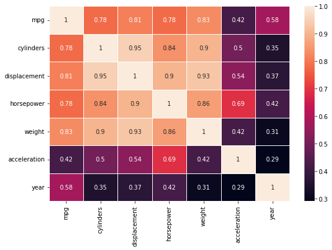
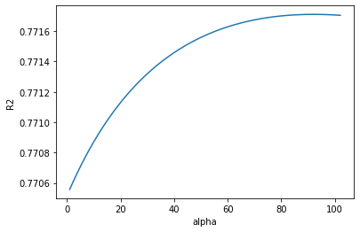
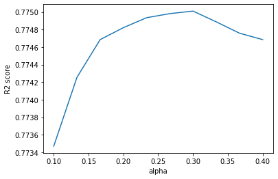

This project studies regressions and regularizations with python.

```python
import numpy as np
import matplotlib.pyplot as plt
import pandas as pd
import seaborn as sns
from sklearn.model_selection import train_test_split
from sklearn.metrics import mean_squared_error, r2_score
from sklearn.linear_model import RidgeCV
from sklearn.linear_model import Lasso
from sklearn.linear_model import LinearRegression
```

```python
#read dataset
df = pd.read_csv('Auto.csv', delimiter=",")
# df.head()
```

```python
dataset = df.drop(['name', 'origin'],axis='columns')
dataset.columns
```

    Index(['mpg', 'cylinders', 'displacement', 'horsepower', 'weight',
           'acceleration', 'year'],
          dtype='object')

```python
fig, ax = plt.subplots(figsize=(9,6))
sns.heatmap(data=dataset.corr().abs().round(2), annot=True, linewidths= 0.5)
plt.show()

print("mpg has high correlation with several features, there is also strong multicollinearity between independent features so we use ridge regression to introduce bias by shrinking parameters")
```



```python
# split the data
X = pd.DataFrame(dataset[['cylinders', 'displacement', 'horsepower', 'weight',
       'acceleration', 'year']], columns = ['cylinders', 'displacement', 'horsepower', 'weight',
       'acceleration', 'year'])
y = df['mpg']

X_train, X_test, y_train, y_test = train_test_split(X, y, test_size=0.2, random_state= 5)
```

```python
#linear regression
model = LinearRegression()
model.fit(X_train, y_train)
```

    LinearRegression()

```python
#linear regression predictions
y_train_predict = model.predict(X_train)
train_r2 = r2_score(y_train, y_train_predict)
train_rmse = (np.sqrt(mean_squared_error(y_train, y_train_predict)))

y_test_predict = model.predict(X_test)
test_r2 = r2_score(y_test, y_test_predict)
test_rmse = (np.sqrt(mean_squared_error(y_test, y_test_predict)))

print(f'train: R2= {train_r2.round(2)} rmse= {train_rmse.round(2)}')
print(f'test: R2= {test_r2.round(2)} rmse= {test_rmse.round(2)}')

print("worse result in test data imply overfitting")
```

    train: R2= 0.81 rmse= 3.23
    test: R2= 0.77 rmse= 4.13

```python
#ridge regressor
alp = np.linspace(1, 1000, 100)

rr = RidgeCV(alphas=alp, scoring='r2')
rr.fit(X_train, y_train)

print(f'R2= {rr.score(X_train, y_train)}')

print("r2 score for model is 0.81. this is middle bias, I presume. RidgeCV was used because it's capability to spit approximation of best alpha.")

```

    R2= 0.8123837301029226

```python
#optimal alpha
opt_alp = rr.alpha_
best_sc = rr.best_score_
coef = rr.coef_

print(f'best alpha= {opt_alp} best score= {best_sc}')

print("model returns 102 as its best alpha and .80 as score using that best alpha")
```

    best alpha= 101.90909090909092 best score= 0.8025545579569762

```python
# plotting the test result
alphas = np.linspace(1, 102, 100)
r2val = []
for alp in alphas:
    rr = RidgeCV(alphas= alp)
    rr.fit(X_train, y_train)
    r2_test = r2_score(y_test, rr.predict(X_test))
    r2val.append(r2_test)

plt.plot(alphas, r2val)
plt.xlabel('alpha')
plt.ylabel('R2')
plt.show()

print("result start to decrease around 100. That would be the ridge i.e alpha value to use")
```



```python
rr = RidgeCV(alphas=100, scoring='r2')
rr.fit(X_test, y_test)
print(rr.score(X_test, y_test))

print("rr.score calculates r2 under the hood. r2 is .83 and improves compared to training data. the model can explain unseen data with creater accuracy than training data. I think model is balanced and ridge regression is one to choose.")
```

    0.8267671158226748

```python
#lasso regressor for test
alp = np.linspace(0.1, 0.4, 10)
test_score = []
coef = []
for i in range (len(alp)):
    lasso = Lasso(alpha=alp[i])
    lasso.fit(X_train, y_train)
    coef.append(lasso.coef_.round(2))
    r2_test = lasso.score(X_test, y_test)
    test_score.append(r2_test)
```

```python
fig, axs = plt.subplots(1, figsize= (6,4))
axs.plot(alp, test_score)
plt.xlabel("alpha")
plt.ylabel("R2 score")
plt.show()

print("peak in r2 is at approximately alpha 0.3. this is the optimal value for lasso regression alpha")
```



```python
# see what is in results
print(f'colmuns: {X_test.columns}')
for i in coef:
    print(i)

print("from below we can see that lasso droppped 'cylinders', 'displacement' and 'horsepower' features as unsable")
```

    colmuns: Index(['cylinders', 'displacement', 'horsepower', 'weight', 'acceleration',
           'year'],
          dtype='object')
    [-0.2   0.01  0.01 -0.01  0.13  0.7 ]
    [-0.08  0.    0.   -0.01  0.12  0.7 ]
    [-0.    0.    0.   -0.01  0.11  0.69]
    [-0.    0.    0.   -0.01  0.1   0.69]
    [-0.    0.    0.   -0.01  0.09  0.68]
    [-0.    0.    0.   -0.01  0.08  0.68]
    [-0.    0.    0.   -0.01  0.07  0.68]
    [-0.    0.   -0.   -0.01  0.06  0.68]
    [-0.    0.   -0.   -0.01  0.05  0.67]
    [-0.    0.   -0.   -0.01  0.05  0.67]

```python
# test with best score
lasso = Lasso(alpha=0.3)
lasso.fit(X_train, y_train)

print(f'train: R2= {lasso.score(X_train, y_train).round(2)}')
print(f'test: R2= {lasso.score(X_test, y_test).round(2)}')

print("model performs worse than ridge regression. model also is not able reduce error on new data. perhaps simplifying the model increases the error, because almost every feature had every strong correlation/relationship with each other. similar results to linear regression.")
```

    train: R2= 0.81
    test: R2= 0.78
