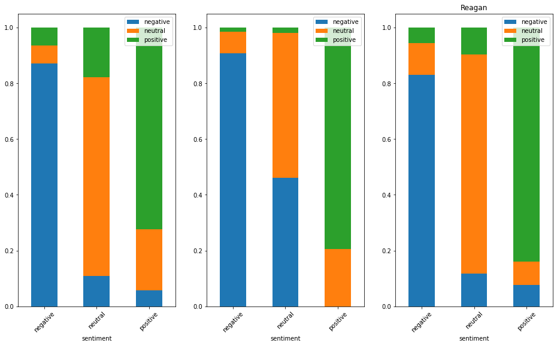

This project is research on using Azure cognitive services NLP capabilities in determining sentiments in longer speeches. This has AI feel to it. There is comparison of Hitler, Gandhi and Reagan.

```python
import numpy as np
import pandas as pd
```

```python
#endpoint and key
key = "05c815187aec4ea28cf3f61e0db8669c"
endpoint = "https://analyzertext.cognitiveservices.azure.com/"
```

```python
from azure.ai.textanalytics import TextAnalyticsClient
from azure.core.credentials import AzureKeyCredential

def authenticate_client():
    ta_credential = AzureKeyCredential(key)
    text_analytics_client = TextAnalyticsClient(
            endpoint=endpoint,
            credential=ta_credential)
    return text_analytics_client
client = authenticate_client()
```

```python
def txt_cleaner(txt_doc):
    import nltk
    from nltk.corpus import stopwords
    from string import punctuation
    doc = txt_doc
    doc = ''.join(c for c in doc if not c.isdigit())
    doc = ''.join(c for c in doc if c not in punctuation).lower()
    doc = ' '.join([word for word in doc.split() if word not in (stopwords.words('english'))])
    return doc
```

```python
def import_rawlines(folder, filename):
    #raw lines
    doc = folder + filename
    with open(doc) as f:
        doc = f.readlines()
        doc = [line.strip() for line in doc if line != '']
    return doc
```

```python
def sentiment_analysis(client, doc):
    documents = doc
    response = client.analyze_sentiment(documents=documents)[0]
    return response
```

```python
fd = "C:/Users/HP/Desktop/nlp/"
fn1 = "Adolf_Hitlers_Stalingrad_Speech.txt"
fn2 = "quit_india_gandhi.txt"
fn3 = "time_for_choosing_reagan.txt"
doc1 = import_rawlines(fd,fn1)
doc2 = import_rawlines(fd,fn2)
doc3 = import_rawlines(fd,fn3)
len(doc1)
```

    225

```python
def clean_doc(dc):
    for line in range(len(dc)):
        ln = txt_cleaner(dc[line])
        dc[line] = ln
    dc = [line for line in dc if line != '']
    return dc
```

```python
doc1 = clean_doc(doc1)
doc2 = clean_doc(doc2)
doc3 = clean_doc(doc3)
```

```python
doc1
```

    ['german fellowcountrymen women party comrades think something extraordinary man years stand old followers make revisions program years',
     'todays gathering however reminds us evening able celebrate former hall years ago reminds us time midst hard fight fight take power germany decisive fate fight waging today past year became known us meaning victory achieved germany would remained powerless nation army men would necessarily submit destruction',
     'time colossus arisen east single thought mind fall upon weak lazy defeatist internallytorn europe time challenge successfully taken power alone capable opposing danger would entered world history',
     'today know would probably europe left therefore battle fought apparently internal struggle power reality even struggle preservation germany broadest sense word preservation europe time close victory yet years ago met former hall one knew exactly close one thing went without saying far concerned namely conviction victory matter happens must come come',
     'conviction stand never left either since day unknown man city began struggle first soul german people beyond city forever followers beginning much give faith faith anyone pursues aim unchanging undisturbed loyalty never lets diverted puts everything others found determined followers host ever stronger faith must gradually radiate whole people host worthiest part whole people must one day finally find together finally worthiest part must acquire power state',
     'today stand view fate providence give victory deserve could year german people deserve time grown confused untrue reason unknown nobody time resolved build movement midst utter ruin complete collapse reason also faith would succeed saw defeatist phenomena crumbling bourgeoismarxist world millions brave men done utmost faltered homeland longer worthy critical hourbecause failed conviction effort bring back internal order german people get hold soundest kernel proved successful another could never repeated',
     'since made resolve many years gone ten years ago dress rehearsal movement already encountered greatest difficultiesin preceding tenyear period many lost faith opponents already saying dead need recall time wonder either movement getting ready seize power collapsed completely leaders either dead wounded prison flight activities',
     'yet barely ten years enough whole movement rise anew ashes like phoenix met years ago another setback manyespecially enemiesbelieved lost chance acted moment offered something would burdened movement made possible realize real aims time stood old party comrades faith absolutely convinced victory best deserves therefore task deserve',
     'years survey period say upon people providence ever bestowed successes upon us miracles achieved last three years face whole world enemies unique history especially crises naturally often years',
     'need remind one great crisis go norway indeed tossup might asked able hold narvik wont entire norwegian undertaking go pieces one needed boundless faith order become despondent time faith finally rewarded far homeland barely single sure line communication connected advanced outpost small heroic german force fighting finally forced evacuate narvik opponents jubilant thanks bravery fanatical determination capitulate circumstances final result victory us opponents',
     'look back entire period let everything pass eyes one thing become obvious us facing opponents always us nothing changed great war opponents conquer war one thing differentiates present time first clearer recognition background actions opponent driving forces secondly successes gained meanwhile successes unique history world',
     'perhaps many person ask question fighting great distances fighting great distances order protect homeland order keep war far removed possible spare would otherwise fate certain german cities experiencing must experience therefore preferable keep front line distance necessary kilometers borders reich hold front somewhere near border reich forced hold',
     'opponents behind opponents stands eternally driving force international jew means accident forces inside met outside internally coalition know well included enemies reich beginning frankfurter zeitung entire stock market speculatorgroup way rote fahne red banner berlin everything lay',
     'outside today coalition chief international masonic lodge halfjew roosevelt jewish brain trust jewry purest water marxistbolshevik russia enemies foes world war external foes struggle internal foes nationalsocialist state external foes',
     'accident state time thought could bring collapse germany flood lying propaganda sends man mission name wilson name roosevelt germany time without education state national politics without unity without enlightenment problem jewish question working power fell victim attack',
     'great mistake enemies imagine happen second time time perhaps best organized people world without doubt best organized people world anyone rest world imagines shatter people know enduring heart people today enduring power knowledge guides people politically todaythe national socialist party mighty organization',
     'neither idea movement achieved since taken hold people accomplishments fulfilled socialist idealwhich free international cheating lying tirades fulfilled socialist ideals way state even begun approach say nothing attain',
     'calm therefore face german fighting east comes home leaveand tell one look organization compare home cities compare workers settlements building compare social organization seen side compare fate lot german farmer lot russian farmer compare dear friend give judgment managed things better else honorable intentions',
     'one man yet returned could express opinion socialistic state process realized anywhere germany actually taking place still another reason world willingly represents capitalistic interests particular attacking us combine even today still pretends able rule world according private capitalistic interests manage necessary keep ruling',
     'example days ago regular snobbish perfumed hooligan like mr eden declared english experience ruling thing one say ruling exploitation plundering experience ruling mean country persons administering square kilometers entire world unemployed beginning war',
     'art ruling say nothing art leadership unscrupulousness robbery man says fine instinct idealism material values yes indeed destroyed idealism everywhere grabbed taken possession material worth always grabbed taken possession brutal force years nation oppressed yoked subjected nation nation people people race race',
     'really brilliant rulers able leave indian people expressed explicit desire wait see whether indians call back careful leave although know rule wonderfully completely one mind plunderers whether run around marxist cap translators note refers typical workmans visored cap used postwar germany symbol communism capitalistic one',
     'friends dont know rule subjugate peoples pauperize benefit handful peoplevery rich ones sureof jewish nonjewish origin determining fate world say calmness germany example ability people rule year reich collapsed blinded german people turned blind faith people hope might shown path would lead back oftheir misery democratic germany nationalsocialist germany',
     'would come democratic germany plundered oppressed way best make second india germany even successful large extent brought us finally many millions persons sort livelihood whatever many millions working parttime brought us finally ten thousands hundreds thousands farmers evicted ancestral plots ground brought us commerce exchange finally came standstill social welfare provisions kind nonexistent tried us governmental experiments india elsewhere headtrampi cant describe wayroosevelt comes declares rescue europe american methods thing say gentleman could bestor besthave rescued country would enter war would fitting get rid unemployed throw world war could solve internal problems setting plunder like british allies recognizing merely idealism primarily material values mr roosevelt knows little idealism aside englishman',
     'art government foes horrible results democratic germany national socialist movement gradually developed really made germany happy would reason would ground devoting work day day week week month month year year',
     'know old fellowcombatants wasnt loafing didnt speak fine club didnt sit fireplace deliver little chat making pilgrimages german countryside north south east west wore order save people misery rulers international capitalism forced',
     'conspiracy jews capitalists bolsheviks time wanted away finally got rid hardly done away world immediately began encirclement',
     'time germany kaiser national socialist germany time kaiser one difference germany time theoretically empire practically gone pieces internally',
     'kaiser time man lacked force resistance enemies face opponent even think word capitulate',
     'thats always way ever since boyat time perhaps improper behavior perhaps virtue allmy habit reserving last word opponents convinced germany former times laid arms quarter twelve principle never quit five minutes twelve domestic foes found ten years ago believe really surprising naturally position internal foes different position external foes today internal foes time',
     'godyou know party comrades began uh uh already easy prophesy whole work would miscarry one side power press power capital conspiracy influential circles parliamentarians petty politicians forth labor unions side employers organizations parliaments reichstag could one single man small group supporters overcome even year still able believe would fail regardless could say still stronger still men behind us others',
     'today must say faith would stifle might already dead anyway actuality today stronger compute number men camp today fighting camp working camp exceeds number today taken positions us certainly longer comparison situation time something else besides battle waged military basis',
     'party comrades behind us great german history english say never yet lost war lost many wars every war fought last ally correct probably distinguishes english method waging war germany great history behind need select one hero history compare fate fatefrederick great worst time actually coalition',
     'today compare position hisour bastions fronts advanced everywhere far beyond bordersthen must say completely stupid imagine ever crush germany especially imagine could possibly impress way could make afraid know perfectly well battle hard one probably difference let us say man like churchill churchill said wethe reichsmarshal ihad made whining speeches recently dont know hit someone right left says absolute defeatism one good laugh',
     'since havent felt like whining previously course sad done everything prevent war recently sven hedin published book gratifyingly quotes word word offer poles conveyed time english must say really felt chill read offer recently thank providence managed everything otherwise',
     'know since time offer accepted danzig would german sure rest everything would remained would devoted social tasks would worked would beautified cities would built dwelling settlements would put roads order would established schools would built real national socialist state',
     'course probably would expended little wehrmacht one day storm would broken loose east would passed poland knew would mere kilometers east berlin thank gentlemen refused rate years ago could yet guess either three years ago sad therefore polish campaign end wanted offer hand peace would cost enemies nothing either know refused forced conduct another campaign still another',
     'year tried offer hand peace refused case settled every offer peace interpreted enemies weakness therefore really turned disadvantage german reich thus would disloyal try anything like clear menow one thing mattersa state world must fall either shall fall consequently must fall',
     'recall old comradesinarms often exactly way held hand internal enemies long wooed pains took didnt bring sensible understanding useless decide take measures ones carried world reason stilled owe brown shirts owe storm troops owe elite guards last hour came rid enemies rid struggle within perhaps seemingly easier external struggle reality men led struggle within fighters externally today fighters within without party comrades one thing certainly reason us national socialists rather proud',
     'bourgeois germany fighting germany composed marxists bourgeois center take one example two deputies reichstag killed course war two million dead national socialist reichstag thus far already left believe field battle total however hardly yes certainly different ratio calculate ratio party comrades say wherever storm troopers party comrades elite guards stand front duty exemplary fashion',
     'reich changed fight also different comprehension know fate would store us world victorious know fate know well even slightest thought compromise gentlemen say time time another peace offer us make something people us peace offers last one made year',
     'one thing left fight said certain moment internal enemies possible come understanding peacefully want force youll get internal enemies taken care',
     'another power strong germany meanwhile able learn experience national socialist prophecies mere phrases main power owe misfortuneinternational jewry recall reichstag session declared judaism imagines chance bring international world war extermination european races result extermination european races extermination jews europe',
     'always derided prophet today countless numbers laughed time laugh longer still laughing also perhaps laugh longer spread beyond europe whole world international jewry recognized demoniac peril national socialists see peril recognized europe country country adopting legislation thus today see vast struggle one single possibility complete success remains question whether reasons doubt success',
     'follow enemies propaganda must say compared quotation rejoicing heaven depressed unto death slightest success anywhere literally turn somersaults joy already destroyed us page turns completely cast depressed need point one example',
     'read russian communiquã©s since june read following every day fighting unimportant character maybe important character shot three times many german planes amount sunken tonnage already greater entire naval tonnage greater types german tonnage war many us missing amount divisions ever muster always fighting place say modestly days evacuated city general fighting since june place always successfully constantly beaten back continued retreat slowly come caucasus say slowly',
     'say enemies soldiers speed soldiers traversed territory gigantic also traversed year vast historically unique always things others want done consider others probably believe opposite principle mr stalin expected would attack center want attack center mr stalin probably believed would didnt care wanted come volga definite place definite city accidentally bears name stalin think went account',
     'indeed could altogether different name important point million tons traffic cut including million oil shipments wheat pours enormous territories ukraine kuban territory transported north manganese ore forwarded gigantic terminal wanted take know modest couple small places left',
     'others say arent fighting dont want make second verdun would rather small shock units time plays part ships come volga morethat decisive thing',
     'also reproached us asking took us long sevastopol want cause enormous mass murder blood flowing ismore enough sevastopol fell hands crimea fell hands reached goal goal stubbornly persistently',
     'enemy part makes preparations attack dont think want forestall moment let attack also defense still less expensive let attack hell bleed death way thus far always taken care situation anyhow',
     'rate russians pyrenees seville see distance us stalingrad today terek let us saybut really disputed fact',
     'naturally nothing else also say mistake suddenly turn around say absolutely mistake germans gone kirkenes gone narvik perhaps stalingradwhat expect stalingrad stalingrad capital mistake strategic mistake wait see whether strategic mistake',
     'see already present indications whether great mistake took possession ukraine weuhtook possession ore region krivoi rog got hands manganese ores whether really great mistake got hold kuban region greatest granary entire world perhaps whether mistake safely say destroyed got possession fourfifths fivesixths refineries alone either right hands completely shut production million tons oil cut transportation perhaps million tons volga',
     'everything else plan whether allthat really mistaken soon see really dont know english managed take ruhr valley rhine danube elbe also would beand also upper silesia donetz region krivoi rog ore region kerch ore region also got portion petroleum sources also got magdeburg stock exchange whether would still say us made great mistake take things away germans extraordinary mistake',
     'impose narrowminded provincial people uhthere may certain number believe yet everyone seem believe hear press comments sometimes become angry say leave stuff say order impose us well must say really confusing presentday germany germany may existed numberless centuries ago cannot convince presentday germany perhaps wish convince say never yet made strategic plans according receipts ideas others',
     'certainly mistake made break france time went around still paid case english marched france even france rather long period time believe frequently boasted men dont want forget one thing party comrades men womenthey near borders divisions besides french divisions approximately another belgian divisions also dutch divisions right borders rhine',
     'say today care advancing somewhere desert well alreadymade advances several times moved back decisive thing war deal final blow sure one',
     'way production course manufacture everything make everything much better whenever americans come something newfor instance read days ago constructed new submarineas read thought surely best right said best submarine world far ingenious construction fastest submerging best every respect compared real amateurs construction submarines',
     'german racial comrades asleep builders asleep either let point one thing winter certain mr churchill stated submarine danger eliminated hitler finished destroyed two three five submarines daily time destroyed even exhausted destroyed nothing committed great error error small number submarines fighting held back greater part submarines order train crews new submarines launched',
     'time number submarines operating enemy small today still ashamed even speak ninetenths remained time home waters trained new crews started mass production certain moment cant comprehend anything american mass production always act ones understand understand well say build soandso many warships per yearwell count corvettes uhuhherring boats rest stick cannon act figure everything guarantee building fewer ships think building useful ships',
     'case proved rate sunk tons almost tons world war number uboats considerably greater number uboats world war go building constructing types weapons gentlemen say wonderful new weapons havent slightest idea whether havent possessed better one long time already',
     'practice put new weapon old one actually use disclose new weapons advance far policy always proved right always worse weapons course worse soldiers perfectly clear far worse organization surprised one compares organization geniuses asuhchurchill duff cooper chamberlain people even roosevelt organizer',
     'one compares people point view organization course nothing blunderers true far achieved one success another regarding internal affairs dear party members also continuously worse internal affairs incompetent qualifications one day came power decisive',
     'understandable one may expect new success perhaps week struggle worldwide extent confronted today impossibility neither decisive decisive fact gradually occupying positions must eventually crush enemy holding fortifying positions way cannot retaken may well believe whatever conquer actually hold tightly way least one else dislodge us wherever gain foothold may rely upon',
     'furthermore war actually far extended allies italians rumanians hungarians finns european peoples slovaks croats spaniards volunteers nordic volunteers real world power achieved world power also suffering continuous defeats',
     'since beginning japans entrance nothing failures everything japanese mistake mistakes added result amounts something brilliant process acquired percent rubber production americans process acquired greatest tin production world acquired enormous wool production acquired gigantic oil wells nothing make mistakes result quite content',
     'conversely others carried none right operations full genius brave heroic calculating indeed great generals macarthur wavell one great ones world never seen generals already writing books generals spite spite people generals first got bit war blessed generals thus speak day brings us indeed recollection greatest collapse movement collapse time really seemed mean also end party enemies certain national socialism dead',
     'day say us national socialists recollection must mean enormous strengthening strengthening defiance dangers never waver never yield meet every emergency courage hold even enemy ever menacing',
     'one must really adopt luthers precept world full devils must shall succeed precisely today look future much confidence survived past winter winter indeed could comprehend terrible danger spoke year ago today look future quite differently',
     'time somehow many even leading thinking people oppressed recollection napoleons fate winter exactly percent cold winter put behind us last year',
     'year indeed prepared quite differently person may lack miss case turn nation request might give perhaps give contribute something else besides winter equipped differently say even prove exactly severe last one happened us last winter longer happen us time',
     'already said great philosopher declared blow knock man makes stronger say blow knock us last winter made us stronger',
     'immaterial front may germany always ward blows always advance attack doubt moment method successful end',
     'today roosevelt conducts attack upon north africa remark must protect germany italy need waste words regarding lies one scoundrel beyond doubt chief gangster whole outfit confronting one may sure mr roosevelt certainly last decisive word matter',
     'shall prepare blows thoroughly always done always struck right time one blow others intended strike us far successful triumphant shouting first englishman landed boulogne advanced six months later triumphant shouting events turned differently different today',
     'may full confidence leaders armed forces must done done unyielding confidence german homeland behind leadership armed forces entire national socialist party particularly stands behind one pledged community distinguishes period last one fact time people stand behind kaiser behind stands one splendid organizations ever built earth organization represents german people',
     'vice versa however distinguishes present time fact head people one would ever critical times go foreign land head people someone never known anything struggle always known one principle strike strike strike',
     'another factor distinguishes present german people time leadership roots people last analysis',
     'today midst completion grew war time returned war brought front experience homeland front experience built home national socialist community people',
     'today national socialist community people goes front perceive many things wehrmacht grows national socialistic month month constantly takes imprint new germany privileges class prejudices eliminated german community people becomes dominant month month end ofthis war german community peoples proved war perhaps distinguishes present germany germany time',
     'owe one hand immeasurable heroism front heroism millions iron soldiers known unknown heroism tens tens thousands brave officers today feel closer community men part already sprung men fact put aside obstacles',
     'party anyone reach position capable even poorest child nation aspire government position even highest one ever since party power also exactly armed forces matter fact theoretically merely exception occurs actual practice today oak leaf wearers subordinate officers corporals knights crosses given numerous iron men distinguished heroically countless officers advanced ranks building army midst war unparalleled history world',
     'back home hand people working must also state german homeland already stated reichstag year munitions factories went strike today overtime work work today thegerman worker homeland knows forging weapons comrades front',
     'accomplished country city men also innumerable women tremendous also quite clear one sphere compete opponents',
     'one time party poorest among parties existing members solely strength idealism natural today also german nation perhaps poorest nations world regards gold reserves',
     'gold capacity work real value sacred industriousness sacred long run thousand times decisive gold struggle life death',
     'value gold treasure translators note uses english term treasures americans except dentures made something sort real benefit ten synthetic rubber factories instead gold would worth entire gold reserves accumulated things built case didnt go war gold provisions necessary conduct struggle anyway germans tank without rubber treads english today',
     'see war material better ever put us possession regions providing raw materials necessary order able last war circumstances anyone says well dont see well simple',
     'dont get idea internationalist gentlemen whatever might call themthat stood front destroyed railroad bridges destroyed railroad tracks destroyed water power works destroyed ore mines destroyed coal mines hands pockets contemplated length years work done gradually beginning pay dividends',
     'next year comes fruits labor really appear say pride party proven mightily innumerable brave party comrades organizing handful persons experienced national socialist district leaders local group leaders organizing gigantic regions opening making regions available efficient industrial economy nourishment fact broader sense feeding maintenance europe',
     'war germany waging alone war actually fought europe thus understandable willingthat many willing volunteers found north south part fighting ranks part arrayed independent armies independent detachments us tremendous front world history therefore irrevocable determination peace come time come really peace europe one without sponsorship men fine instinct idealism material values',
     'instinct mr eden idealism dont know never proved shown anywhere behavior doesnt indicate either culture country means could possibly impress us man across ocean shall speak connection instinct idealism surely smaller instinct probably given idealism world society care mr eden applies people allies look back upon cultures compared culture english island kingdom really infinitely young say infantile culture',
     'regarding material values however believe fine instinct difference want make sure circumstances material values europe future benefit european peoples also extracontinental little international finances cliquethat unshakable inexorable resolve people europe fighting afterwards people fine instincts come along begin plunder mankind make millions unemployed order fill vaults',
     'good reason depart gold standard wished eliminate way one conditions kind economic conception economic management certain europe come war much healthier economically large part continent hitherto organized europe placed service european nations',
     'told ha ha want transplant dutch well want transplant one believe many people happy get bit earth able work drudge slave partly case oversettled overfilled continent however happy get benefit reward work peoples benefit working men women benefit vault bank london wish new york believe therefore end war collapse domination gold externally also thereby collapse whole society blame war',
     'know mission national socialist party need repeat today started fight enemy interior done everything find way world work organized laughed us yes always laughed whenever new substitute materials ersatzstoffe done pleasure compelled either millions men would work unbelievable values would produced would adapt new methods done',
     'performing work simultaneously identified peace wanted maintain peace enemies rejected national socialism fighting phenomenon many many years interior today one exterior surroundings outside world expect party member representative faith victory success utmost fanaticism period struggle today much easier today must admire party members party many small men believed unknown nameless soldier world war men followed time placed lives disposal many gave lives time old reich also eastern territories sudeten country also elsewhere countries',
     'must admire followed time absolutely unknown man today appears us together powerful great reich stands us entire nation every national socialist believed still fanatic fight outside today must struggle fanatical consistency possessed time opponents mercy allowed contrary one possibility either fall opponent falls aware men enough look knowledge straight eye cool ice differentiates gentlemen london america require much german soldier demanding always ready also',
     'demand german nation calling work also require overtime work many dont even know overtime life dont know every individual good tune perhaps certain time leave work free work fate reich cant leave pursues day night stepped head nation',
     'days gray misery wretchedness grief ruin leave would ridiculous leave leave always eyes one single thing germany people future future children therefore demand one else therefore demand one else demand ready',
     'know old party comrades actually constitute core movement memory first blood sacrifices offered us time already leading nation example joined hundreds hundreds thousands millions national socialist functionaries party members belong organizations associated us marching us men storm troops schutzstaffel elite guard marching us men labor front marching us men reich labor service short entire national socialist german people',
     'wonderful thing today isolated like people crying wilderness case every word address nation today finds thousandfold echo',
     'foe believes soften us means whatsoever mistaken influence turn aside objective hour strikes hit back interest compound interest',
     'remember long period legal party comrades often old party comrades come say fuehrer also called chief days said adolf hitler may strike back take years force repeatedly legal',
     'expel party members movement aching heart believed could obey command year year finally hour came could call upon',
     'thats way today sometimes months time let things go somewhere dont believe make heart feel like bursting anger hear airraids know things months allow single bomb dropped city paris attacked warsaw called surrender five times always refused asked least women children sent even officer bearing flag truce received everything refused decide permitted every law war',
     'english started drop bombs waited three half months nothing time many said dont answer isnt already strong enough waited thinking simply perhaps would still come senses',
     'turned differently believe different today taking note still learn german spirit invention rested get answer leave dizzy',
     'already tell people several times fact dont talk long time mean lost voice means consider expedient talk today talk lot today last analysis front talks everything else babble rarest occasion would like take floor front says forceful unique language binding upon every single german anyway whoever reads army communiquã© wehrmacht communiquã© make fanatically one people hearing tremendous number heroic deeds cannot helped talk either',
     'outside worldwell speak benefit outside world never yet spoken outside world speak german people whether people abroad listen entirely immaterial',
     'mr roosevelt says hear speeches say talk mr roosevelts benefit accosted telegraph thereupon gave reply polite man would otherwise talk mr roosevelt talk instrument one talk today instrument talks loud distinct enough',
     'otherwise talk rarest occasions movement german people say speech one thing think incessantly men women fact war decide people understand one thoughts actions one single prayer germany']

```python
def sentence_count(doc):
    df = pd.DataFrame(columns= ['s_sentiment','s_positive','s_negative','s_neutral'], dtype=int)
    for i in range(len(doc)):
        temp = []
        temp.append(''.join(doc[i]))
        r = sentiment_analysis(client, temp)
        df2 = pd.DataFrame(columns= ['s_sentiment','s_positive','s_negative','s_neutral'], dtype=int)
        for idx, sentence in enumerate(r.sentences):
            df2 = df2.append({'s_sentiment':sentence.sentiment,
                        's_positive':sentence.confidence_scores.positive,
                        's_negative':sentence.confidence_scores.negative,
                        's_neutral': sentence.confidence_scores.neutral
                       }, ignore_index=True)
        df = df.append(df2)
    return df
```

```python
def sentiment_count(doc):
#sets df and write n:o words by sentiment to it
    df = pd.DataFrame(0, index= range(len(doc)), columns=['sentiment','positive','negative','neutral'], dtype= int)

    for i in range(len(doc)):
        temp = []
        temp.append(''.join(doc[i]))

        r = sentiment_analysis(client, temp)
        df.loc[int(i), 'sentiment'] = r.sentiment
        df.loc[int(i), 'positive'] = r.confidence_scores.positive
        df.loc[int(i), 'negative'] = r.confidence_scores.negative
        df.loc[int(i), 'neutral'] = r.confidence_scores.neutral

    return df
```

```python
hitler_sense = sentiment_count(doc1)
gandhi_sense = sentiment_count(doc2)
reagan_sense = sentiment_count(doc3)
```

```python
import pandas as pd
import matplotlib.pyplot as plt
import numpy as np
```

```python
cols = ['negative','neutral','positive','sentiment']
fig, axis= plt.subplots(1,3,figsize=(16,9))

pivot_hitler = pd.pivot_table(hitler_sense[cols], index = 'sentiment')
ax1 = axis[0]
pivot_hitler.plot(kind='bar', stacked=True, rot=45, zorder=1, ax= ax1)
plt.title('Hitler')

pivot_gandhi = pd.pivot_table(gandhi_sense[cols], index = 'sentiment')
ax2 = axis[1]
pivot_gandhi.plot(kind='bar', stacked=True, rot=45,zorder=1, ax= ax2)
plt.title('Gandhi')

pv_reagan = pd.pivot_table(reagan_sense[cols], index = 'sentiment')
ax3 = axis[2]

pv_reagan.plot(kind='bar', stacked=True, rot=45,mark_right=True, ax=ax3)
plt.title('Reagan')
```

    Text(0.5, 1.0, 'Reagan')



left to right: Hitler - Gandhi - Reagan

[back](https://kaimhall.github.io/portfolio/misc_machine_learning)
