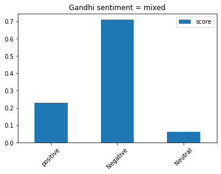

this project is about opinion mining, keyfrases, named entities and summarizations. NLP project with Azure API. Analyzes Gandhis speech.

```python
import numpy as np
import pandas as pd
import matplotlib.pyplot as plt
import nltk
```

```python
#endpoint and key
key = "05c815187aec4ea28cf3f61e0db8669c"
endpoint = "https://analyzertext.cognitiveservices.azure.com/"
```

```python
doc2 = [open("C:\\Users\\HP\\Desktop\\nlp\\quit_india_gandhi.txt",'r').read().strip().replace('\n','')]
doc2
```

    ['Let me explain my position clearly. God has vouchsafed to me a priceless gift in the weapon of Ahimsa. I and my Ahimsa are on our trail today. If in the present crisis, when the earth is being scorched by the flames of Himsa and crying for deliverance, I failed to make use of the God given talent, God will not forgive me and I shall be judged unworthy of the great gift. I must act now. I may not hesitate and merely look on, when Russia and China are threatened.Ours is not a drive for power, but purely a non-violent fight for India’s independence. In a violent struggle, a successful general has been often known to effect a military coup and to set up a dictatorship. But under the Congress scheme of things, essentially non-violent as it is, there can be no room for dictatorship. A non-violent soldier of freedom will covet nothing for himself, he fights only for the freedom of his country. The Congress is unconcerned as to who will rule, when freedom is attained. The power, when it comes, will belong to the people of India, and it will be for them to decide to whom it placed in the entrusted. May be that the reins will be placed in the hands of the Parsis, for instance-as I would love to see happen-or they may be handed to some others whose names are not heard in the Congress today.It will not be for you then to object saying, "This community is microscopic. That party did not play its due part in the freedom\'s struggle; why should it have all the power?" Ever since its inception the Congress has kept itself meticulously free of the communal taint. It has thought always in terms of the whole nation and has acted accordingly. . . I know how imperfect our Ahimsa is and how far away we are still from the ideal, but in Ahimsa there is no final failure or defeat. I have faith, therefore, that if, in spite of our shortcomings, the big thing does happen, it will be because God wanted to help us by crowning with success our silent, unremitting Sadhana for the last twenty-two years.I believe that in the history of the world, there has not been a more genuinely democratic struggle for freedom than ours. I read Carlyle’s French Revolution while I was in prison, and Pandit Jawaharlal has told me something about the Russian revolution. But it is my conviction that inasmuch as these struggles were fought with the weapon of violence they failed to realize the democratic ideal. In the democracy which I have envisaged, a democracy established by non-violence, there will be equal freedom for all. Everybody will be his own master. It is to join a struggle for such democracy that I invite you today. Once you realize this you will forget the differences between the Hindus and Muslims, and think of yourselves as Indians only, engaged in the common struggle for independence.Then, there is the question of your attitude towards the British. I have noticed that there is hatred towards the British among the people. The people say they are disgusted with their behaviour. The people make no distinction between British imperialism and the British people. To them, the two are one. This hatred would even make them welcome the Japanese. It is most dangerous. It means that they will exchange one slavery for another. We must get rid of this feeling.Our quarrel is not with the British people, we fight their imperialism. The proposal for the withdrawal of British power did not come out of anger. It came to enable India to play its due part at the present critical juncture It is not a happy position for a big country like India to be merely helping with money and material obtained willy-nilly from her while the United Nations are conducting the war. We cannot evoke the true spirit of sacrifice and velour, so long as we are not free. I know the British Government will not be able to withhold freedom from us, when we have made enough self-sacrifice. We must, therefore, purge ourselves of hatred.Speaking for myself, I can say that I have never felt any hatred. As a matter of fact, I feel myself to be a greater friend of the British now than ever before. One reason is that they are today in distress. My very friendship, therefore, demands that I should try to save them from their mistakes. As I view the situation, they are on the brink of an abyss. It, therefore, becomes my duty to warn them of their danger even though it may, for the time being, anger them to the point of cutting off the friendly hand that is stretched out to help them. People may laugh, nevertheless that is my claim. At a time when I may have to launch the biggest struggle of my life, I may not harbor hatred against anybody.']

```python
from azure.ai.textanalytics import TextAnalyticsClient
from azure.core.credentials import AzureKeyCredential

def authenticate_client():
    ta_credential = AzureKeyCredential(key)
    text_analytics_client = TextAnalyticsClient(
            endpoint=endpoint,
            credential=ta_credential)
    return text_analytics_client

client = authenticate_client()
```

```python
def text_analyze(client, doc):
    documents = doc

    result = client.analyze_sentiment(documents, show_opinion_mining=True)
    doc_result = [doc for doc in result if not doc.is_error]
    return result
```

```python
r = text_analyze(client, doc2)
print(r)
```

    [AnalyzeSentimentResult(id=0, sentiment=mixed, warnings=[], statistics=None, confidence_scores=SentimentConfidenceScores(positive=0.23, neutral=0.06, negative=0.71), sentences=[SentenceSentiment(text=Let me explain my position clearly., sentiment=neutral, confidence_scores=SentimentConfidenceScores(positive=0.02, neutral=0.97, negative=0.01), length=35, offset=0, mined_opinions=[]), SentenceSentiment(text=God has vouchsafed to me a priceless gift in the weapon of Ahimsa., sentiment=positive, confidence_scores=SentimentConfidenceScores(positive=0.99, neutral=0.01, negative=0.0), length=66, offset=36, mined_opinions=[]), SentenceSentiment(text=I and my Ahimsa are on our trail today., sentiment=neutral, confidence_scores=SentimentConfidenceScores(positive=0.01, neutral=0.99, negative=0.0), length=39, offset=103, mined_opinions=[]), SentenceSentiment(text=If in the present crisis, when the earth is being scorched by the flames of Himsa and crying for deliverance, I failed to make use of the God given talent, God w]

text analysis/ opinion Mining

analysis

```python
sentiments = ['positive','negative','neutral']
values = []
res = {'sentiment':sentiments,'score':values}
for doc in r:
    print(f'Sentiment: {doc.sentiment}')

    values.append(doc.confidence_scores.positive)
    values.append(doc.confidence_scores.negative)
    values.append(doc.confidence_scores.neutral)
df_gandhi = pd.DataFrame(res)

df_gandhi.plot(kind = 'bar')
plt.title('Gandhi sentiment = mixed')
plt.xticks(np.arange(3), ('positive', 'Negative', 'Neutral'),rotation= 45)

```

    Sentiment: mixed


    ([<matplotlib.axis.XTick at 0x1f25209b4c0>,
      <matplotlib.axis.XTick at 0x1f25209b490>,
      <matplotlib.axis.XTick at 0x1f2520db880>],
     [Text(0, 0, 'positive'), Text(1, 0, 'Negative'), Text(2, 0, 'Neutral')])



opinions

```python
for sentence in(r[0].sentences):
    for opinion in sentence.mined_opinions:
        target = opinion.target
        print(f'target: {target.text}')
        print(f'sentiment: {target.sentiment}')
        print('-'*10)
        for assesment in opinion.assessments:
            print(f'assesment {assesment.text}')
            print(f'sentiment {assesment.sentiment}')
            print('-'*10)

```

    target: gift
    sentiment: positive
    ----------
    assesment great
    sentiment positive
    ----------
    target: room
    sentiment: negative
    ----------
    assesment non-violent
    sentiment negative
    ----------
    target: Congress
    sentiment: negative
    ----------
    assesment unconcerned
    sentiment negative
    ----------
    target: community
    sentiment: negative
    ----------
    assesment microscopic
    sentiment negative
    ----------
    target: party
    sentiment: negative
    ----------
    assesment play
    sentiment negative
    ----------
    target: Ahimsa
    sentiment: negative
    ----------
    assesment imperfect
    sentiment negative
    ----------
    target: behaviour
    sentiment: negative
    ----------
    assesment disgusted
    sentiment negative
    ----------
    target: people
    sentiment: negative
    ----------
    assesment distinction
    sentiment negative
    ----------
    target: position
    sentiment: negative
    ----------
    assesment happy
    sentiment negative
    ----------

KeyFrases

```python
def key_phrases(client, doc):
    try:
        documents = doc
        response = client.extract_key_phrases(documents = documents)[0]
        if response.is_error:
            print(response.id, response.error)

    except Exception as err:
        print("Encountered exception. {}".format(err))
    return response
```

```python
r2 = key_phrases(client, doc2)
```

```python
print(r2.key_phrases[:10])
```

    ['silent, unremitting Sadhana', 'last twenty-two years', 'present critical juncture', 'present crisis', 'priceless gift', 'great gift', 'violent fight', 'successful general', 'military coup', 'due part']

entity recognition

```python
def entity_recognition(client, doc):
    try:
        documents = doc
        result = client.recognize_entities(documents = documents)[0]
    except Exception as err:
        print("Encountered exception. {}".format(err))
    return result
```

```python
r3 = entity_recognition(client, doc2)
r3
```

    RecognizeEntitiesResult(id=0, entities=[CategorizedEntity(text=Ahimsa, category=Person, subcategory=None, length=6, offset=95, confidence_score=0.71), CategorizedEntity(text=Ahimsa, category=Person, subcategory=None, length=6, offset=112, confidence_score=0.96), CategorizedEntity(text=today, category=DateTime, subcategory=Date, length=5, offset=136, confidence_score=0.8), CategorizedEntity(text=God, category=Person, subcategory=None, length=3, offset=299, confidence_score=0.55), CategorizedEntity(text=now, category=DateTime, subcategory=None, length=3, offset=384, confidence_score=0.8), CategorizedEntity(text=Russia, category=Location, subcategory=GPE, length=6, offset=433, confidence_score=1.0), CategorizedEntity(text=China, category=Location, subcategory=GPE, length=5, offset=444, confidence_score=1.0), CategorizedEntity(text=India, category=Location, subcategory=GPE, length=5, offset=531, confidence_score=1.0), CategorizedEntity(text=general, category=PersonType, subcategory=None, length=7, offset=589, con

```python
for entity in r3.entities:
    if entity.confidence_score > 0.96:
        print(f'text: {entity.text} category: {entity.category}')
        print(f'confidense: {round(entity.confidence_score,2)}')
```

    text: Russia category: Location
    confidense: 1.0
    text: China category: Location
    confidense: 1.0
    text: India category: Location
    confidense: 1.0
    text: Congress category: Organization
    confidense: 0.98
    text: India category: Location
    confidense: 0.98
    text: Congress category: Organization
    confidense: 0.97
    text: Carlyle category: Person
    confidense: 0.99
    text: prison category: Location
    confidense: 0.97
    text: Pandit Jawaharlal category: Person
    confidense: 1.0
    text: Hindus category: PersonType
    confidense: 0.97
    text: Muslims category: PersonType
    confidense: 0.98
    text: Indians category: PersonType
    confidense: 0.98
    text: British category: PersonType
    confidense: 0.98
    text: Japanese category: PersonType
    confidense: 0.97
    text: India category: Location
    confidense: 0.99
    text: India category: Location
    confidense: 1.0
    text: United Nations category: Organization
    confidense: 0.98

summary

```python
def summarization(client, doc):
    from azure.ai.textanalytics import ExtractSummaryAction

    document = doc
    poller = client.begin_analyze_actions(document, actions=[ExtractSummaryAction(MaxSentenceCount=12)],)

    document_results = poller.result()
    for result in document_results:
        extract_summary_result = result[0]  # first document, first result
        if extract_summary_result.is_error:
            print("...Is an error with code '{}' and message '{}'".format(extract_summary_result.code, extract_summary_result.message))
    return extract_summary_result
```

```python
r4 = summarization(client, doc2)
r4
```

    ExtractSummaryResult(id=0, sentences=[SummarySentence(text=Let me explain my position clearly., rank_score=1.0, offset=0, length=35), SummarySentence(text=God has vouchsafed to me a priceless gift in the weapon of Ahimsa., rank_score=0.98, offset=36, length=66), SummarySentence(text=I and my Ahimsa are on our trail today., rank_score=0.99, offset=103, length=39)], warnings=[], statistics=None, is_error=False)

```python
summary = " ".join([sentence.text for sentence in r4.sentences])
summary
```

    'Let me explain my position clearly. God has vouchsafed to me a priceless gift in the weapon of Ahimsa. I and my Ahimsa are on our trail today.'

```python
from string import punctuation
from nltk.corpus import stopwords
nltk.download('stopwords')
from nltk.stem.porter import PorterStemmer
ps = PorterStemmer()
from nltk.probability import FreqDist
from nltk import tokenize
```

    [nltk_data] Downloading package stopwords to C:\Users\HP/nltk_data...
    [nltk_data]   Package stopwords is already up-to-date!

```python
cleaned_doc2 = ''.join(c for c in doc2 if not c.isdigit())
cleaned_doc2 = ''.join(c for c in cleaned_doc2 if c not in punctuation).lower()
cleaned_doc2 = ' '.join([word for word in cleaned_doc2.split() if word not in (stopwords.words('english'))])
words = tokenize.word_tokenize(cleaned_doc2)
stems = [ps.stem(word) for word in words]
fdist = FreqDist(stems)
count_frame = pd.DataFrame(fdist, index = [0]).T
count_frame.columns = ['count']
```

```python
count_frame.sort_values('count', ascending=False)
top_ten_words = count_frame[:10].index
```

```python
phrases = ' '.join(r2.key_phrases).replace(',','')
phrases = tokenize.word_tokenize(phrases)
len(phrases)
```

    150

```python
phrases_set = set(phrases)
top_ten_set = set(top_ten_words)
phrases_set.intersection(top_ten_set)
```

    {'gift', 'priceless', 'weapon'}

[back](https://kaimhall.github.io/portfolio/misc_machine_learning)
